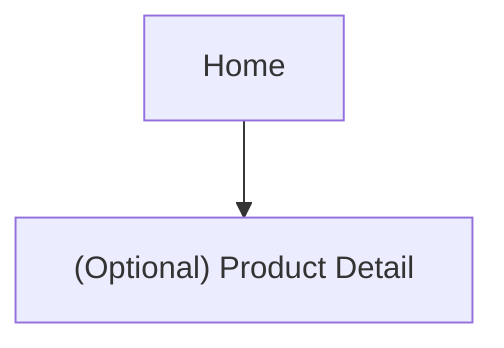

## 1. Product Overview
Implement a pixel-perfect product card + horizontal product slider (carousel) that matches the provided UI reference, including mouse-interactive particle effects.
The feature is aimed at improving product discovery and “browse feel” on desktop-first storefront experiences.

## 2. Core Features

### 2.1 User Roles
Role separation is not required for this feature.

### 2.2 Feature Module
Our requirements consist of the following main pages:
1. **Home**: product slider section, product cards, slider controls, particle interaction layer.

### 2.3 Page Details
| Page Name | Module Name | Feature description |
|---|---|---|
| Home | Product Slider Section | Render a horizontally scrollable/animated slider containing product cards; load items from provided data source; respect `sort_order` for ordering; support responsive item counts while remaining desktop-first. |
| Home | Product Card | Display product image, title, pricing (incl. sale state if present in data), and a primary action (e.g., view/buy) exactly as reference; support hover/focus states; ensure consistent aspect ratios and truncation rules. |
| Home | Slider Controls | Provide arrow controls and pagination/scroll indicators as per reference; allow keyboard navigation; expose disabled states at bounds (if non-looping). |
| Home | Particle Interaction Layer | Emit lightweight particles responding to mouse movement over the slider region; particles visually match reference (size, blur, opacity, color); degrade gracefully on reduced-motion or low-power devices. |
| Home | Analytics Hooks (optional if already present) | Emit events for card impression and card click if your app already tracks analytics; do not introduce new tracking vendors. |

## 3. Core Process
### Shopper flow
1. You open Home and see a product slider section.
2. You swipe/drag (trackpad) or use arrows to browse products.
3. As you move the mouse over the slider region, particles subtly react/emit.
4. You hover a product card to see its interactive state and click through via the primary action.

### Page navigation flowchart

## Pre-implementation documentation (what must be defined before dev)
### A. “Pixel-perfect clone” definition
- Reference snapshot set: 1) default state, 2) hover card, 3) slider mid-scroll, 4) slider end state, 5) reduced-motion state.
- Tolerances:
  - Spacing/layout: ±1px (desktop), ±2px (smaller breakpoints).
  - Typography: font family/weight/line-height must match; letter spacing must match.
  - Colors: match within expected sRGB rounding (no theme drift).

### B. Data contract (minimum fields)
- Product: `id`, `title`, `image_url`, `price`, `compare_at_price?`, `currency`, `href` (or routing id), `sort_order`.
- Slider context: optional `collection_id` / `placement_key` for scoping sort order.

### C. Motion + particles constraints
- Particle budget: cap active particles (e.g., 40–120 depending on effect).
- Prefer requestAnimationFrame and CSS transforms; avoid layout thrash.
- Respect `prefers-reduced-motion`: disable emission and keep a static decorative state.

### D. Accessibility acceptance
- Full keyboard access to slider controls and cards.
- Visible focus rings consistent with the design system.
- Pointer-only behaviors must have keyboard equivalents where relevant.

### E. `sort_order` strategy (render-order source of truth)
- Ordering rule: primary sort by `sort_order` ASC, secondary sort by `created_at` DESC (or stable `id`) to break ties.
- Scoping rule: `sort_order` is interpreted within the slider’s placement context (e.g., a specific “Featured” slider).
- Recommended values: use spaced integers (e.g., 1000, 2000, 3000…) to allow inserts without renumbering.
- Tie handling: if two items share the same `sort_order`, preserve stable secondary order to prevent UI jitter.

## Post-implementation documentation (definition of done)
### A. Visual QA checklist
- Card dimensions, padding, corner radius, shadows match reference.
- Image cropping/fit rules match (no stretch).
- Typography and price formatting match reference.
- Hover states: scale/outline/shadow/overlay exactly match reference.
- Slider: scroll physics, snap/spacing, control placement match reference.

### B. Interaction + performance checklist
- Particles do not drop below 55–60fps on typical desktops.
- No memory growth after 60s of continuous mouse movement.
- Reduced-motion disables particle animation.
- Works with mouse, trackpad horizontal scroll, and keyboard.

### C. Ordering correctness checklist
- Given a shuffled dataset, rendered order matches `sort_order` ASC.
- Inserting an item with `sort_order=1500` appears between 1000 and 2000 without resequencing.
- Duplicated `sort_order` values do not cause reordering between renders (stable secondary key).
