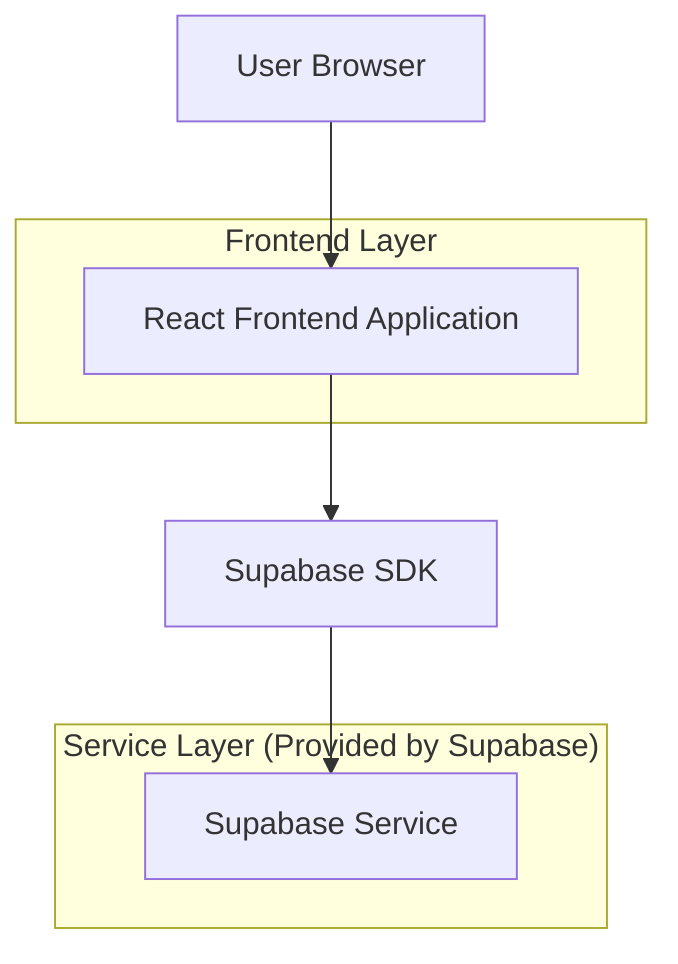
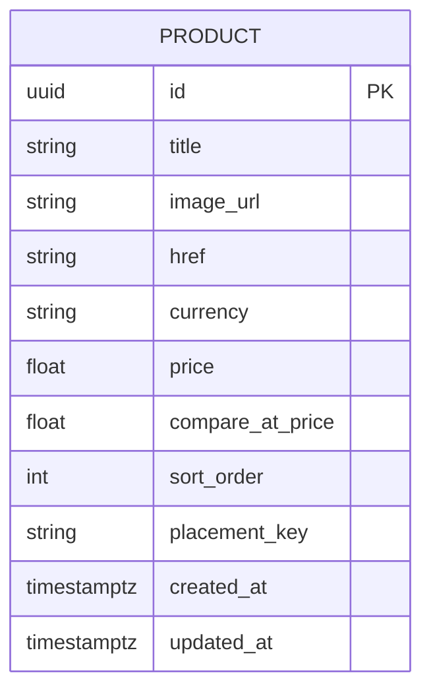

## 1.Architecture design


## 2.Technology Description
- Frontend: React@18 + Next.js (project default) + tailwindcss@3
- Backend: Supabase (Auth optional; DB + Storage if product images are stored there)

## 3.Route definitions
| Route | Purpose |
|---|---|
| / | Home page containing the product slider section |

## 6.Data model(if applicable)
### 6.1 Data model definition


### 6.2 Data Definition Language
Product Table (products)
```
CREATE TABLE products (
  id UUID PRIMARY KEY DEFAULT gen_random_uuid(),
  title TEXT NOT NULL,
  image_url TEXT NOT NULL,
  href TEXT NOT NULL,
  currency TEXT NOT NULL DEFAULT 'USD',
  price NUMERIC(12,2) NOT NULL,
  compare_at_price NUMERIC(12,2),
  placement_key TEXT NOT NULL,
  sort_order INTEGER NOT NULL DEFAULT 1000,
  created_at TIMESTAMPTZ NOT NULL DEFAULT NOW(),
  updated_at TIMESTAMPTZ NOT NULL DEFAULT NOW()
);

-- Recommended indexes for stable ordering + lookup
CREATE INDEX idx_products_placement_sort ON products(placement_key, sort_order, created_at DESC);

-- Minimal permissions (adjust to your security model)
GRANT SELECT ON products TO anon;
GRANT ALL PRIVILEGES ON products TO authenticated;
```

## `sort_order` strategy (implementation notes)
### Goals
- Stable, deterministic ordering across renders and pagination.
- Cheap inserts/reorders without full resequencing.

### Rules
- Query order: `ORDER BY sort_order ASC, created_at DESC, id ASC`.
- Use spaced values: 1000, 2000, 3000…
- Scope ordering by `placement_key` (e.g., "home_featured", "home_new", "home_sale").

### Insert between two items
- If between A(sort=1000) and B(sort=2000): assign 1500.
- If gap becomes too small (e.g., consecutive integers), run resequence job (offline/admin-only): reassign to 1000-step spacing.

### Reorder (move item to position k)
1. Fetch neighbors around k (prev, next) within the same placement_key.
2. If both exist, set `sort_order = floor((prev.sort_order + next.sort_order)/2)`.
3. If moving to start/end, set `sort_order = next.sort_order - 1000` or `prev.sort_order + 1000`.

## Particle system technical approach (frontend-only)
- Render particles in a single overlay layer on top of the slider region.
- Store particle state in an in-memory pool; reuse objects to reduce GC.
- Use `requestAnimationFrame` for updates; use CSS transforms for movement.
- Respect `prefers-reduced-motion`: turn off emission + animation loop.
- For pointer tracking: attach listeners to the slider container; throttle pointermove to ~60hz (or less if needed).
